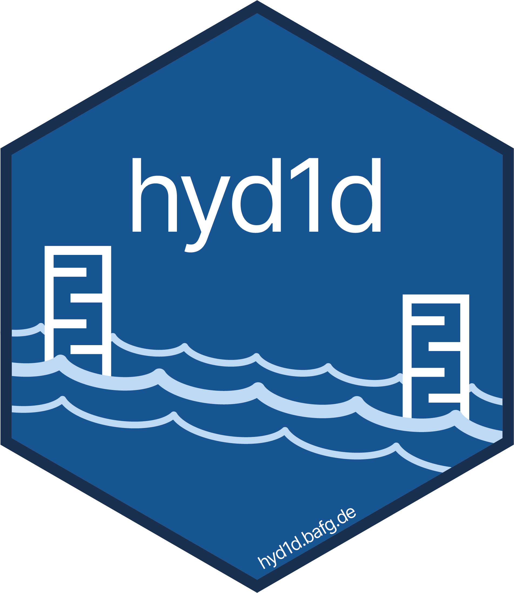

```{r setup, include = FALSE}
knitr::opts_chunk$set(
    echo = TRUE,
    fig.path = "man/figures/README-",
    fig.align="center",
    fig.width = 6,
    fig.height = 4)
```

<!-- README.md is generated from README.Rmd. Please edit that file -->

# hyd1d 

<!-- badges: start -->
[](https://cran.r-project.org/package=hyd1d)
[](https://cran.r-project.org/package=hyd1d)
[](https://cran.r-project.org/package=hyd1d)
[](https://cran.r-project.org/package=hyd1d)
<!-- badges: end -->

The R package **hyd1d** is designed to compute 1-dimensional water level 
information along the German Federal Waterways Elbe and Rhine.

## Installation

**hyd1d** is available from CRAN. To install it run:

```{r install_cran, eval = FALSE}
install.packages("hyd1d")
```

To install the latest development version from Github run:

```{r install_git, eval = FALSE}
install.packages("devtools")
library(devtools)
devtools::install_github("bafg-bund/hyd1d")
```

## Usage

The package **hyd1d** is build around the S4-class `WaterLevelDataFrame`. To 
compute and visualize 1-dimensional water level information an object of class 
`WaterLevelDataFrame` has to be initialized. Various functions included in 
**hyd1d** use these objects and compute water levels stored in the column `w`.

```{r language, error = FALSE, message = FALSE, warning = FALSE, include = FALSE}
# set english locale to produce english plot labels
Sys.setlocale(category = "LC_MESSAGES", locale = "en_US")
```

```{r usage, eval = TRUE, error = FALSE, warning = FALSE, message = FALSE, fig.alt = "example output of hyd1d::plotShiny()"}
# load the package
library(hyd1d)

# initialize a WaterLevelDataFrame
wldf <- WaterLevelDataFrame(river   = "Elbe",
                            time    = as.POSIXct("2016-12-21"),
                            station = seq(257, 262, 0.1))

# compute a water level
wldf <- waterLevel(wldf, TRUE)

# and plot it
plotShiny(wldf, TRUE, TRUE, TRUE, xlim = c(256.8, 262.2))
```
