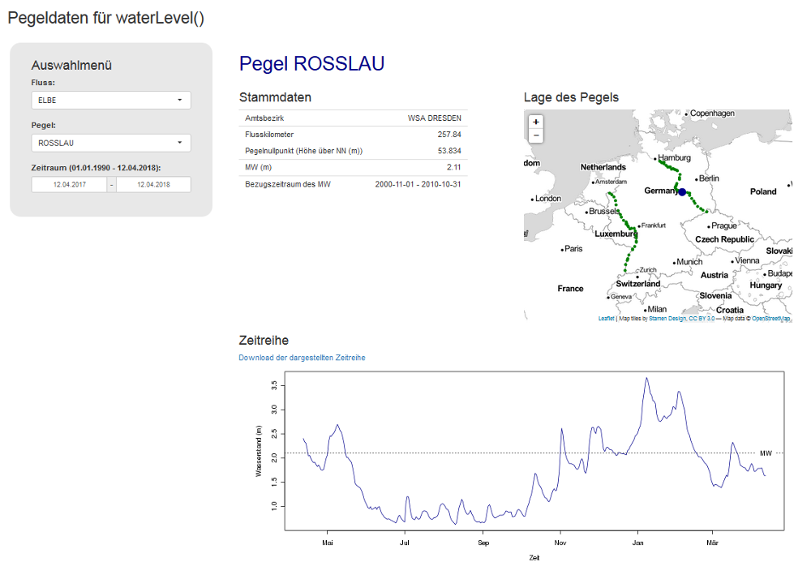
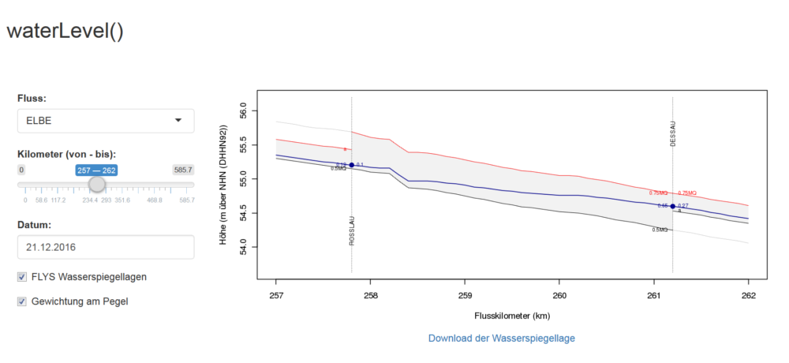
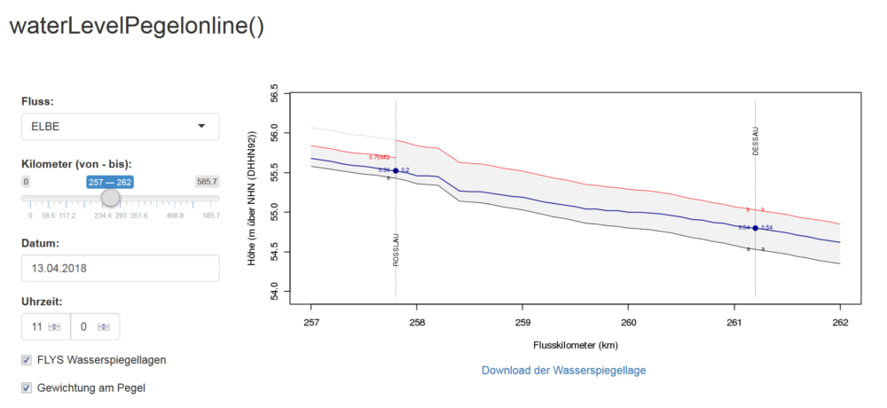
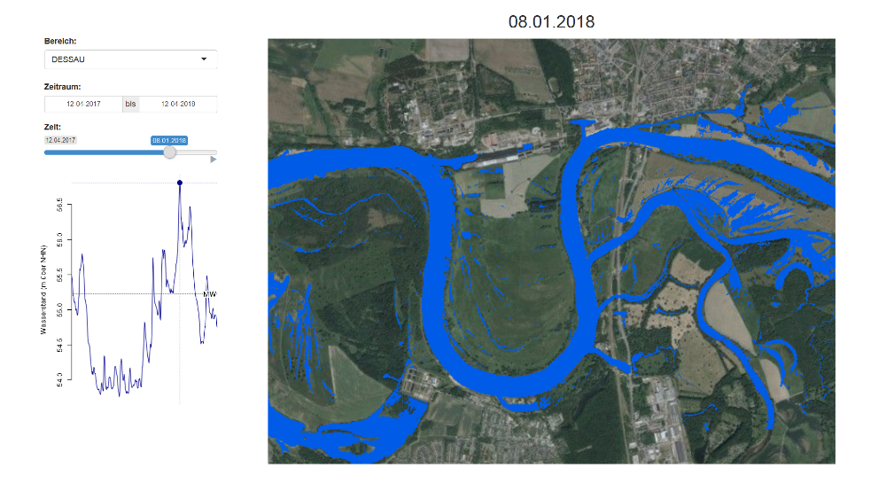

```{r setup, include = FALSE}
knitr::opts_chunk$set(
    collapse = TRUE, 
    comment = "#>", 
    fig.align="center", 
    fig.width = 7, 
    fig.height = 4, 
    root.dir = "/home/WeberA/hyd1d-old/hyd1d/vignettes"
)
```

<!-- Indent in html version TOC
     obtained from: 
     https://stackoverflow.com/questions/46201753/rmarkdown-indentation-of-toc-items-in-html-output
     -->

<script>
$(document).ready(function() {
  $items = $('div#TOC li');
  $items.each(function(idx) {
    num_ul = $(this).parentsUntil('#TOC').length;
    $(this).css({'padding-left': num_ul * 5px, 'box-shadow': none});
  });

});
</script>

<!-- numbering for figures and tables-->
```{r captions, echo = FALSE}
library(stringr)

# Determine the output format of the document
outputFormat <- knitr::opts_knit$get("rmarkdown.pandoc.to")

# Figure and Table Caption Numbering, for HTML do it manually
capTabNo <- 1
capFigNo <- 1

# Function to add the Table Number
capTab <- function(x){
    if(outputFormat == 'html'){
        x <- paste0("**Tab. ", capTabNo, "**: ", x)
        capTabNo <<- capTabNo + 1
    } else if (outputFormat == 'latex'){
        y <- str_replace_all(x, '(^.*)(\\[.*\\])(\\(.*\\))(.*$)', 
                             '\\1\\\\href{\\3}{\\2}\\4')
        y <- gsub("{(", "{", y, fixed = TRUE)
        y <- gsub("{[", "{", y, fixed = TRUE)
        y <- gsub(")}", "}", y, fixed = TRUE)
        y <- gsub("]}", "}", y, fixed = TRUE)
        x <- gsub("_", "\\_", y, fixed = TRUE)
    }
    return(x)
}

# Function to add the Figure Number
capFig <- function(x){
    if(outputFormat == 'html'){
        x <- paste0("**Abb. ", capFigNo, "**: ", x)
        capFigNo <<- capFigNo + 1
    } else if (outputFormat == 'latex'){
        y <- str_replace_all(x, '(^.*)(\\[.*\\])(\\(.*\\))(.*$)', 
                             '\\1\\\\href{\\3}{\\2}\\4')
        y <- gsub("{(", "{", y, fixed = TRUE)
        y <- gsub("{[", "{", y, fixed = TRUE)
        y <- gsub(")}", "}", y, fixed = TRUE)
        y <- gsub("]}", "}", y, fixed = TRUE)
        x <- gsub("_", "\\_", y, fixed = TRUE)
    }
    return(x)
}
```

<BR>
\newpage

# Das Problem {#problem}

> Wie erhält man Wasserstandsinformationen für einen Punkt oder eine Strecke an
einer Bundeswasserstraße zu einem ausgewählten Zeitpunkt?

## PEGELONLINE {#problem_pegelonline}

Entlang der Bundeswasserstraßen Deutschlands gibt es eine Vielzahl von 
Pegelmessstellen. Diese Messstellen werden überwiegend von der Wasserstraßen- und 
Schifffahrtsverwaltung des Bundes (WSV) betrieben und liefern Wasserstandsmesswerte 
alle 15 Minuten, in tidebeinflussten Gewässern sogar alle Minute. Für die 
Öffentlichkeit werden die ungeprüften Messdaten zentral gesammelt und über eine 
Webseite bis 30 Tage rückwirkend veröffentlicht:

<p style="text-align: center;"><https://pegelonline.wsv.de></p>

Durch die manuelle Auswahl entsprechender Pegel von [PEGELONLINE](https://pegelonline.wsv.de) 
lassen sich näherungsweise, flussabschnittsbezogene Wasserstandsentwicklungen 
beobachten und bewerten, wie hier an den Pegeln 
[Rosslau](https://pegelonline.wsv.de/gast/stammdaten?pegelnr=501490) und 
[Dessau](https://pegelonline.wsv.de/gast/stammdaten?pegelnr=502000) zu sehen 
ist: 

```{r figure01, echo = FALSE, error = FALSE, fig.cap = capFig("Tagesgemittelte Wasserstände vom 21.12.2016 an der Elbe bei Rosslau und Dessau."), fig.show = 'asis', message = FALSE, warning = FALSE}
require(hyd1d, lib.loc = "/home/WeberA/R/3.4")
require(plotrix)
xlim_min <- 257
xlim_max <- 263
ylim_min <- 53.8
ylim_max <- 55.7
wldf <- WaterLevelDataFrame(river = "Elbe",
                            time = as.POSIXct("2016-12-21"),
                            station = seq(257, 262, 0.1))
wldf1 <- waterLevel(wldf, TRUE)
gs <- getGaugingStations(wldf1)
id <- gs$km_qps >= xlim_min & gs$km_qps <= xlim_max

{
    plot(1, 1, type = "n", xlim = c(xlim_min, xlim_max), 
         ylim = c(ylim_min, ylim_max), xlab = "Flusskilometer (km)", 
         ylab = "H\u00f6he (m \u00fcber NHN (DHHN92))")
    
    # landmarks
    abline(v = gs$km_qps[2:3], lty = 3, lwd = 0.5)
    boxed.labels(gs$km_qps[2], 54, gs$gauging_station[2], cex = 0.7, 
                 border = FALSE)
    boxed.labels(gs$km_qps[3], 55.5, gs$gauging_station[3], cex = 0.7, 
                 border = FALSE)
    abline(v = 259.6, lty = 3, lwd = 0.5, col = "blue")
    boxed.labels(259.6, 55.5, "MULDE", cex = 0.7, border = FALSE, col = "blue")
    
    # gauging data
    points(gs$km_qps[id], gs$wl[id], pch = 21, col = "darkblue", 
           bg = "darkblue")
    
    # legend
    legend("topright", 
           pch = 21, col = "darkblue", pt.bg = "darkblue", pt.cex = 1,
           legend = "Wasserstand", cex = 0.7, bty = "n")
}
```

Exakte Informationen sind allerdings nur für die Pegelstandorte verfügbar, was 
dazu führt, dass beim Risikomanagement im Rahmen der Hochwasservorhersage immer 
Bezug auf relevante Pegelstände genommen wird, und die Rede ist von: 

> Ab einem Wasserstand von X am Pegel Y wird die Schifffahrt eingestellt, werden 
die Flutschutztore geschlossen, etc.

Wo die Wasserspiegellagen entlang der Gewässerachse - also zwischen den Pegeln - 
liegen, läßt sich mittels der lokalen Messdaten von [PEGELONLINE](https://pegelonline.wsv.de) 
nicht ermitteln. 

---
nocite: | 
  @wsv_pegelonline_2018
...

## FLYS {#problem_flys}

### Entwicklung {#problem_flys_entwicklung}

Um diese Informationslücke zu schliessen und Wasserstandsinformationen für 
beliebige Orte entlang eines Gewässers zu generieren, wird an der 
[Bundesanstalt für Gewässerkunde (BfG)](https://www.bafg.de) seit 1998 an der 
Flusshydrologische Software FLYS gearbeitet. Nach 15 Jahren Entwicklungsarbeit 
wurde im Jahr 2013 mit FLYS3 ein web-basierter Fachdienst veröffentlicht, der 
es registrierten Nutzern ermöglicht Wasserstände für beliebige Orte und 
Strecken für ausgewählte Abflüsse, bzw. Wasserstände an Pegeln abzuleiten:

<p style="text-align: center;">[FLYS – Flusshydrologischer Webdienst](https://www.bafg.de/DE/08_Ref/M2/03_Fliessgewmod/01_FLYS/flys_node.html)</p>

### Methodik {#problem_flys_methodik}

FLYS ist kein hydraulisches Modell, sondern ein Werkzeug zur Verarbeitung und 
Interpolation von bestehenden Modellergebnissen. Diese bestehenden 
Modellergebnisse sind in der Regel Ergebnisse von 1-dimensionalen hydraulischen
Berechnungen mit dem Modell SOBEK [@deltares_sobek_2018], welche für die 
meisten Bundeswasserstraßen bereits vorliegen. Für jeweils 30 stationäre 
Abflusszustände, von extremen Niedrigwassern (0,5 * mittleres Niedrigwasser 
(**0.5MNQ**)) bis zu extremen Hochwassern (500-jährliches Hochwasser 
(**HQ500**)), decken diese Simulationen die gesamte Bandbreite möglicher 
hydraulischer Zustände ab.

```{r figure02, fig.show = 'asis', fig.cap = capFig("FLYS Wasserspiegellagen an der Elbe bei Rosslau und Dessau."), echo = FALSE, error = FALSE, warning = FALSE, message = FALSE}
flys3_water_levels <- c("0.5MNQ", "MNQ", "0.5MQ", "a", "0.75MQ", "b", "MQ", "c",
                        "2MQ", "3MQ", "d", "e", "MHQ", "HQ2", "f", "HQ5", "g", 
                        "h", "HQ10", "HQ15", "HQ20", "HQ25", "HQ50", "HQ75", 
                        "HQ100", "i", "HQ150", "HQ200", "HQ300", "HQ500")

{
    plot(1, 1, type = "n", xlim = c(xlim_min, xlim_max), ylim = c(53, 62), 
         xlab = "Flusskilometer (km)", 
         ylab = "H\u00f6he (m \u00fcber NHN (DHHN92))")
    for (a_wl in flys3_water_levels){
        wldf_temp <- waterLevelFlys3(wldf, a_wl)
        if (a_wl %in% c("0.5MNQ", "MNQ", "MQ", "MHQ", "HQ10", "HQ100", "HQ500")){
            lines(wldf_temp$station, wldf_temp$w, lty = 1, col = "darkblue")
            text(262.0, wldf_temp$w[nrow(wldf_temp)], a_wl, pos = 4, cex = 0.6)
        } else {
            lines(wldf_temp$station, wldf_temp$w, lty = 3, lwd = 0.2, 
                  col = "darkblue")
        }
    }
    abline(v = gs$km_qps[2:3], lty = 3, lwd = 0.5)
    boxed.labels(gs$km_qps[2], 53.5, gs$gauging_station[2], cex = 0.7, 
                 border = FALSE)
    boxed.labels(gs$km_qps[3], 61.5, gs$gauging_station[3], cex = 0.7, 
                 border = FALSE)
    abline(v = 259.6, lty = 3, lwd = 0.5, col = "blue")
    boxed.labels(259.6, 61.5, "MULDE", cex = 0.7, border = FALSE, col = "blue")
}
```

An Beispieldaten eines ausgesuchten Tages, dem 21.12.2016, umgeben drei stationäre FLYS3-Wasserspiegellagen die tagesgemittelten Pegelmesswerte von Rosslau und 
Dessau und lassen erste visuelle Abschätzungen zu:

```{r figure03, fig.show = 'asis', fig.cap = capFig("Ausgewählte stationäre FLYS3 Wasserspiegellagen (**0.5MQ**, **a** und **0.75MQ**) und Wasserstände vom 21.12.2016 an der Elbe bei Rosslau und Dessau."), echo = FALSE, error = FALSE, warning = FALSE, message = FALSE}
mq_0.5 <- waterLevelFlys3(wldf, "0.5MQ")
a <- waterLevelFlys3(wldf, "a")
mq_0.75 <- waterLevelFlys3(wldf, "0.75MQ")
mq <- waterLevelFlys3(wldf, "MQ")

{
    plot(1, 1, type = "n", xlim = c(xlim_min, xlim_max), 
         ylim = c(ylim_min, ylim_max), xlab = "Flusskilometer (km)", 
         ylab = "H\u00f6he (m \u00fcber NHN (DHHN92))")
    
    # landmarks
    abline(v = gs$km_qps[2:3], lty = 3, lwd = 0.5)
    boxed.labels(gs$km_qps[2], 54, gs$gauging_station[2], cex = 0.7, 
                 border = FALSE)
    boxed.labels(gs$km_qps[3], 55.5, gs$gauging_station[3], cex = 0.7, 
                 border = FALSE)
    abline(v = 259.6, lty = 3, lwd = 0.5, col = "blue")
    boxed.labels(259.6, 55.5, "MULDE", cex = 0.7, border = FALSE, col = "blue")
    
    # gauging data
    points(gs$km_qps[id], gs$wl[id], pch = 21, col = "darkblue", 
           bg = "darkblue")
    
    # FLYS
    lines(mq_0.5$station, mq_0.5$w, col = "darkblue")
    lines(a$station, a$w, col = "darkblue")
    lines(mq_0.75$station, mq_0.75$w, col = "darkblue")
    text(262, min(mq_0.5$w), "0.5MQ", pos = 4, cex = 0.6)
    text(262, min(a$w), "a", pos = 4, cex = 0.6)
    text(262, min(mq_0.75$w), "0.75MQ", pos = 4, cex = 0.6)
    
    # legend
    legend("topright", 
           pch = 21, col = "darkblue", pt.bg = "darkblue", pt.cex = 1,
           legend = "Wasserstand", cex = 0.7, bty = "n")
}
```

Für die Berechnung eines Wasserstandes entlang der Gewässerachse eines Flusses 
mit Bezug zu einem Wasserstand an einem Pegel sind in der Weboberfläche von FLYS3
mehrere Arbeitsschritte vorzunehmen. Am Beispiel der Elbe zwischen Rosslau und 
Dessau für den Tag des 21.12.2016 sind dies:

1. Auswahl des Berechungsmoduls **W-INFO**
2. Auswahl des Gewässers **Elbe**
3. Auswahl der Berechnungsart **Wasserstand/Wasserspiegellage**
4. Festlegung der Berechnungsstrecke von Kilometer **257** bis **262** mit Werten alle **100** m
5. Auswahl des Bezugspegels **Wittenberg**
6. Eingabe des Bezugswasserstandes von **`r getGaugingDataW("WITTENBERG", as.Date("2016-12-21"))`** cm am Bezugspegel (Tagesmittelwert des 21.12.2016)

Diese Eingaben der genannten Daten liefern folgendes Ergebnis:

<!-- 
```{r echo = FALSE, out.width=6}
knitr::include_graphics('flys_export_1.png')
```

```{r echo = FALSE, out.width=6}
knitr::include_graphics('flys_export_2.png')
```
--->

```{r figure04, fig.show = 'asis', fig.cap = capFig("FLYS Wasserspiegellage an der Elbe bei Rosslau und Dessau bei einem Wasserstand von 174 cm am Pegel Wittenberg (Tagesmittelwert des 21.12.2016)."), echo = FALSE, error = FALSE, warning = FALSE, message = FALSE}
wldf2 <- waterLevelFlys3InterpolateY(wldf, "WITTENBERG", shiny = TRUE)
wldf3 <- waterLevelFlys3InterpolateY(wldf, "ROSSLAU", shiny = TRUE)
wldf4 <- waterLevelFlys3InterpolateY(wldf, "DESSAU", shiny = TRUE)

{
    plotShiny(wldf2, FALSE, FALSE, FALSE, xlim = c(xlim_min, xlim_max),
              ylim = c(ylim_min, ylim_max))
    
    # landmarks
    abline(v = gs$km_qps[2:3], lty = 3, lwd = 0.5)
    boxed.labels(gs$km_qps[2], 54, gs$gauging_station[2], cex = 0.7, 
                 border = FALSE)
    boxed.labels(gs$km_qps[3], 55.5, gs$gauging_station[3], cex = 0.7, 
                 border = FALSE)
    abline(v = 259.6, lty = 3, lwd = 0.5, col = "blue")
    boxed.labels(259.6, 55.5, "MULDE", cex = 0.7, border = FALSE, col = "blue")
    
    # gauging data
    points(gs$km_qps[id], gs$wl[id], pch = 21, col = "darkblue", 
           bg = "darkblue")
    
    # legend
    legend("topright", 
           pch = 21, col = "darkblue", pt.bg = "darkblue", pt.cex = 1,
           legend = "Wasserstand", cex = 0.7, bty = "n")
    #text(262.5, 55.5, "Bezugs-\npegel", cex = 0.7)
    text(262, min(wldf2$w), "Bezugspegel\nWITTENBERG", pos = 4, cex = 0.6)
    #text(262, min(wldf3$w), "ROSSLAU", pos = 4, cex = 0.6)
    #text(262, min(wldf4$w), "DESSAU", pos = 4, cex = 0.6)
}
```

### Probleme durch die Auswahl des Bezugspegels {#problem_flys_bezugspegel}

Am Pegel Rosslau ist die Abweichung zwischen gemessenem Wasserstand(`r getGaugingDataW("ROSSLAU", as.Date("2016-12-21"))` cm $\widehat{=}$ `r round(gs$wl[2], 2)` m über NHN) und 
mittels FLYS3 berechnetem Wasserstand (`r round((wldf2$w[which(wldf2$station == gs$km_qps[2])] - gs$pnp[2]) * 100, 0)`
cm $\widehat{=}$ `r wldf2$w[which(wldf2$station == gs$km_qps[2])]` m über NHN)
gering und beträgt nur `r - round((wldf2$w[which(wldf2$station == gs$km_qps[2])] - gs$pnp[2]) * 100, 0) + getGaugingDataW("ROSSLAU", as.Date("2016-12-21"))`
cm. Am Pegel Dessau, unterhalb der Mündung der Mulde, beträgt die Abweichung 
zwischen gemessenem Wasserstand (`r getGaugingDataW("DESSAU", as.Date("2016-12-21"))` cm $\widehat{=}$ `r round(gs$wl[3], 2)` m über NHN)) und 
mittels FLYS3 berechnetem Wasserstand (`r round((wldf2$w[which(wldf2$station == gs$km_qps[3])] - gs$pnp[3]) * 100, 0)`
cm $\widehat{=}$ `r wldf2$w[which(wldf2$station == gs$km_qps[3])]` m über NHN) 
aber bereits `r - round((wldf2$w[which(wldf2$station == gs$km_qps[3])] - gs$pnp[3]) * 100, 0) + getGaugingDataW("DESSAU", as.Date("2016-12-21"))` cm.

Wendet man nun den FLYS3 Algorithmus zur Interpolation der stationären 
Wasserspiegellagen mit den relevanten Bezugspegeln Rosslau und Dessau an und 
fügt diese der Abbildung hinzu, so ergibt sich folgendes Bild:

```{r figure05, fig.show = 'asis', fig.cap = capFig("FLYS Wasserspiegellagen an der Elbe bei Rosslau und Dessau berechnet mittels der Bezugspegel Wittenberg, Rosslau und Dessau."), echo = FALSE, error = FALSE, warning = FALSE, message = FALSE}
{
    plotShiny(wldf2, FALSE, FALSE, FALSE, xlim = c(xlim_min, xlim_max),
              ylim = c(ylim_min, ylim_max))
    polygon(x = c(wldf3$station, rev(wldf4$station)),
            y = c(wldf3$w, rev(wldf4$w)), col = "grey95", border = NA)
    lines(wldf2$station, wldf2$w, lty = 1, col = "darkblue")
    lines(wldf3$station, wldf3$w, lty = 2, col = "darkblue")
    lines(wldf4$station, wldf4$w, lty = 3, col = "darkblue")
    
    # landmarks
    abline(v = gs$km_qps[2:3], lty = 3, lwd = 0.5)
    boxed.labels(gs$km_qps[2], 54, gs$gauging_station[2], cex = 0.7, 
                 border = FALSE)
    boxed.labels(gs$km_qps[3], 55.5, gs$gauging_station[3], cex = 0.7, 
                 border = FALSE)
    abline(v = 259.6, lty = 3, lwd = 0.5, col = "blue")
    boxed.labels(259.6, 55.5, "MULDE", cex = 0.7, border = FALSE, col = "blue")
    
    # gauging data
    points(gs$km_qps[id], gs$wl[id], pch = 21, col = "darkblue", 
           bg = "darkblue")
    
    # legend
    legend("topright", 
           pch = 21, col = "darkblue", pt.bg = "darkblue", pt.cex = 1,
           legend = "Wasserstand", cex = 0.7, bty = "n")
    text(262.5, 54.7, "Bezugspegel", cex = 0.7)
    text(262, min(wldf2$w), "WITTENBERG", pos = 4, cex = 0.6)
    text(262, min(wldf3$w), "ROSSLAU", pos = 4, cex = 0.6)
    text(262, min(wldf4$w), "DESSAU", pos = 4, cex = 0.6)
}
```

Ganz offensichtlich hat die Wahl des Bezugspegels einen maßgeblichen Einfluss 
auf die Lage der resultierenden Wasserspiegellagen und die Differenzen zwischen 
der höchsten und der niedrigsten der drei Wasserspiegellagen betragen 
`r round(min(abs(wldf3$w - wldf4$w)) * 100, 0)` bis 
`r round(max(abs(wldf3$w - wldf4$w)) * 100, 0)` cm.

Bedingt durch die Stationarität der FLYS3 zu Grunde liegenden SOBEK-Modelle, ist 
FLYS3 gut geeignet zeitlich gemittelte, langfristige Daten zu verarbeiten. Bei
der Aufstellung der 30 stationären Abflussmodelle wurden Zuflüsse signifikanter 
Nebengewässer ebenso mit stationären, langfristig gemittelten Abflüssen als 
Randbedingungen integriert. In Situationen in denen Nebengewässer mit 
signifikanten Abflussvolumina jedoch stark vom Abflusszustand des 
Hauptgewässers abweichen, kommt die Wasserspiegellagenberechnung mittels FLYS3, 
die nur von einem Bezugspegel abhängt, an ihre Grenzen. Das wiederum führt zu 
starken Abweichungen im Bereich mehrerer Dezimeter zwischen berechneten 
Wasserspiegellagen und gemessenen Wasserständen.

Im verwendeten Beispiel liegt der Abfluss der Elbe am Pegel Rosslau knapp über 
**0.5MQ** (~200 m^3^/sec). Der Pegel Dessau-Brücke weist die Mulde einen 
relativ hohen Abfluss nahe eines **MQ** auf (~75 m^3^/sec), was unterhalb der 
Mündung dazu führt, dass die stationäre Wasserspiegellage **a** (~272 m^3^/sec) 
der Elbe überschritten wird. Der Wasserstand in Dessau ist somit ca. 30 cm 
höher, als die Wasserstandssituation in Rosslau erwarten ließ. Um derartige 
Effekte durch Instationaritäten aufzufangen und kontinuierliche 
Wasserspiegellagen berechnen zu können, sind also andere Berechnungsmethoden 
notwendig, welche im Folgenden präsentiert werden.

---
nocite: | 
  @bundesanstalt_fur_gewasserkunde_flys_2016
...

<BR>

# Die Lösung {#loesung}

Das R-Paket **hyd1d** wurde entwickelt, um die Instationaritäten, die bei der 
Verwendung von FLYS3 Probleme bereiten, zu berücksichtigen und durchgehende, 
stetige Wasserspiegellagen für lange Gewässerabschnitte zu berechnen. Dafür 
werden Pegeldaten, die über [PEGELONLINE](https://pegelonline.wsv.de) oder die 
[HyDaBa](http://www.bafg.de/DE/08_Ref/M1/03_Pegelwesen/HYDABA/hydaba_node.html) 
zur Verfügung stehen oder gestellt werden können, mit den stationären 
Wasserspiegellagen von FLYS3 verrechnet.

## Grundlagen {#loesung_grundlagen}

Die grundlegenden Daten, die für die Berechnung von Wasserspiegellagen verwendet
werden, wurden in der Problembeschreibung bereits genannt und verwendet. Dabei 
handelt es sich einerseits um Pegeldaten, andererseits um die Wasserspiegellagen
von FLYS3.

### Pegeldaten {#loesung_grundlagen_pegeldaten}

In den Funktionen des Paketes **hyd1d** werden zwei unterschiedliche 
Datenbestände von Pegeldaten verwendet und über Stammdaten verknüpft.

#### PEGELONLINE {#loesung_grundlagen_pegeldaten_pegelonline}

Das Portal [PEGELONLINE](https://pegelonline.wsv.de) ermöglicht einen 
Zugriff auf **unvalidierte** Pegelmesswerte aller Pegel, die von der
Wasserstraßen- und Schifffahrstverwaltung betrieben werden. Diese Daten sind 
jedoch nur 30 Tage rückwirkend vorhanden und werden dannach vom Server gelöscht.

Der Zugriff auf diese Daten innerhalb von **hyd1d** erfolgt online über die 
PEGELONLINE REST-Schnittstelle, die allen Entwicklern offen steht und gut 
dokumentiert ist:

<p style="text-align: center;"><https://www.pegelonline.wsv.de/webservice/dokuRestapi></p>

Entsprechend kodierte Abfragen auf die PEGELONLINE REST-Schnittstelle werden mit
Objekten in JSON-Notation beantwortet, die paketintern weiter verarbeitet 
werden.

#### HyDaBa {#loesung_grundlagen_pegeldaten_hydaba}

Die [HyDaBa](http://www.bafg.de/DE/08_Ref/M1/03_Pegelwesen/HYDABA/hydaba_node.html), 
die gewässerkundliche Datenbank der WSV, wird durch die BfG betrieben und 
gepflegt. Diese Datenbank enthält **validierte**, teilweise auch historische
Wasserstands- und Abflussdaten für mehrere hundert Pegel der WSV und auch der
Bundesländer. Allerdings sind diese Datenbestände bisher nicht online verfügbar.
Daher wird innerhalb des Pakets **hyd1d** ein Auszug aus der 
[HyDaBa](http://www.bafg.de/DE/08_Ref/M1/03_Pegelwesen/HYDABA/hydaba_node.html)
mitgeliefert.

Konkret handelt es sich dabei um tagesgemittelte Wasserstandswerte 
für die Pegel entlang des Rheins und der deutschen Binnenelbe seit dem 
01.01.1990. Diese Pegeldaten sind innerhalb des Paketes als `data.frame`-Objekt 
[df.gauging_data](reference/df.gauging_data.html)
eingebettet und werden paket-intern regelmäßig automatisiert aktualisiert
([updateGaugingData](reference/updateGaugingData.html)).

#### Stammdaten {#loesung_grundlagen_pegeldaten_stammdaten}

Um die Daten von [PEGELONLINE](https://pegelonline.wsv.de) und aus der 
[HyDaBa](http://www.bafg.de/DE/08_Ref/M1/03_Pegelwesen/HYDABA/hydaba_node.html)
nebeneinander nutzen und verknüpfen zu können, sind Stammdaten notwendig. 
Innerhalb des Pakets **hyd1d** ist ein eigener Stammdatensatz vorhanden 
([df.gauging_station_data](reference/df.gauging_station_data.html))
, der zentral gepflegt und aktualisiert wird.

### FLYS3 Wasserspiegellagen {#loesung_grundlagen_flys}

Auch die stationären Wasserspiegellagen für Elbe und Rhein aus FLYS3 sind in das
Paket **hyd1d** integriert. Der paket-interne Datensatz
[df.flys_data](reference/df.flys_data.html)
beinhaltet die 30 stationären Wasserspiegellagen für den Rhein 
[@hkv_hydrokontor_erstellung_2014] und die Elbe [@busch_einheitliche_2009]. Die
räumlichen Auflösung der Daten beträgt im Normalfall 200 m, was 
Wasserspiegellageninformationen an jedem gerade Hektometer entspricht. Alle 
Wasserspiegellageninformationen dazwischen müssen linear interpoliert werden 
([waterLevelFlys3InterpolateX](reference/waterLevelFlys3InterpolateX.html)).

## Methodik {#loesung_methodik}

Während die bisher üblichen Verfahren der Abschätzung oder Berechnung von 
Wasserspiegellagen ([PEGELONLINE](#problem_pegelonline) und 
[FLYS3](#problem_flys)) nur einen Bezugspegel haben, verwendet **hyd1d** die 
verfügbaren Pegeldaten aller Pegel auf der zu berechnenden Strecke und die 
nächsten oberhalb und unterhalb gelegenen. An den Pegeln selbst entspricht der 
berechnete Wasserstand den Pegelmesswerten. Zwischen den Pegeln erfolgt eine 
entfernungsabhängige Interpolation anhand der Wasserspiegellagen von FLYS. 

Insgesamt gliedert sich die Berechnung in fünf Schritte, die im weiteren Verlauf
näher erläutert werden:

1. Bestimmung der relevanten Pegel für den Berechnungsort, bzw. die
Berechnungsstrecke
2. Berechnung der Wasserspiegellagen an den relevanten Pegeln für einen 
gewählten Zeitpunkt
3. Aufteilung der Berechnungsstrecke in Abschnitte, die von jeweils zwei Pegeln 
eingerahmt werden
4. Abschnittsweise Bestimmung, welche FLYS3-Wasserspiegellagen die 
Wasserspiegellagen an den beiden Pegeln einrahmen
5. Abschnittsweise, entfernungsabhängige Interpolation zwischen den einrahmenden
FLYS3-Wasserspiegellagen

### Auswahl streckenbezogener Bezugspegel

Für die ausgewählte exemplarische Berechnungsstrecke von Kilometer 257,0 bis 
262,0 an der Elbe sind vier Pegel relevant. Zwei Pegel liegen innerhalb der 
Berechnungsstrecke, nämlich Rosslau und Dessau. Der nächste Pegel stromauf der
Berechnungsstrecke ist Vockerode bei Kilometer 245,0. Der nächste Pegel stromab
der Berechnungsstrecke ist Aken bei Kilometer 274,8.

```{r figure06, fig.show = 'asis', fig.cap = capFig("Relevante Bezugspegel für die Berechnungsstrecke von Kilometer 257 bis 262 an der Elbe bei Rosslau und Dessau."), echo = FALSE, error = FALSE, warning = FALSE, message = FALSE}
{
    plot(1, 1, type = "n", xlim = c(243, 276.8), 
         ylim = c(51, 58), xlab = "Flusskilometer (km)", 
         ylab = "H\u00f6he (m \u00fcber NHN (DHHN92))")
    
    # berechnungsstrecke
    polygon(x = c(257, 262, 262, 257),
            y = c(50.8, 50.8, 58.2, 58.2),
            col = "grey95", border = NA)
    
    # landmarks
    abline(v = gs$km_qps, lty = 3, lwd = 0.5)
    text(gs$km_qps[1:2], c(52, 52), gs$gauging_station[1:2], cex = 0.7)
    text(gs$km_qps[3:4], c(57, 57), gs$gauging_station[3:4], cex = 0.7)
    
}
```

### Berechnung der Wasserspiegellagen an den Bezugspegeln

Im folgenden Schritt werden die Pegeldaten für einen gewählten Zeitpunkt 
ermittelt, was in diesem Beispiel der 21.12.2016 ist. Dafür werden die 
Wasserstandswerte (cm) durch 100 dividiert und zu dem jeweiligen Pegelnullpunkt
(PNP in m über Normalhöhennull (NHN)) addiert.

```{r figure07, fig.show = 'asis', fig.cap = capFig("Wasserstände an den relevanten Bezugspegeln für die Berechnungsstrecke von Kilometer 257 bis 262 an der Elbe bei Rosslau und Dessau."), echo = FALSE, error = FALSE, warning = FALSE, message = FALSE}
{
    plot(1, 1, type = "n", xlim = c(243, 276.8), 
         ylim = c(51, 58), xlab = "Flusskilometer (km)", 
         ylab = "H\u00f6he (m \u00fcber NHN (DHHN92))")
    
    # stretch
    polygon(x = c(257, 262, 262, 257),
            y = c(50.8, 50.8, 58.2, 58.2),
            col = "grey95", border = NA)
    
    # landmarks
    abline(v = gs$km_qps, lty = 3, lwd = 0.5)
    text(gs$km_qps[1:2], c(52, 52), gs$gauging_station[1:2], cex = 0.7)
    text(gs$km_qps[3:4], c(57, 57), gs$gauging_station[3:4], cex = 0.7)
    
    # gauging data
    points(gs$km_qps, gs$wl, pch = 21, col = "darkblue", bg = "darkblue")
    
    # legend
    legend("topright", 
           pch = 21, col = "darkblue", pt.bg = "darkblue", pt.cex = 1,
           legend = "Wasserstand", cex = 0.7, bty = "o", box.col = "white")
    box()
}
```

### Bestimmung der einrahmenden FLYS3-Wasserspiegellagen

Die weiteren Berechnungen erfolgen abschnittsweise, wobei die jeweiligen 
Berechnungsabschnitte jeweils von zwei benachbarten Pegeln eingerahmt werden. 

```{r figure08, fig.show = 'asis', fig.cap = capFig("Berechnungsabschnitte für die Berechnungsstrecke von Kilometer 257 bis 262 an der Elbe bei Rosslau und Dessau."), echo = FALSE, error = FALSE, warning = FALSE, message = FALSE}
{
    plot(1, 1, type = "n", xlim = c(243, 276.8), 
         ylim = c(51, 58), xlab = "Flusskilometer (km)", 
         ylab = "H\u00f6he (m \u00fcber NHN (DHHN92))")
    
    # stretch
    polygon(x = c(257, 262, 262, 257),
            y = c(50.8, 50.8, 58.2, 58.2),
            col = "grey95", border = NA)
    
    # sections
    for (i in 1:(nrow(gs) - 1)) {
        rect(gs$km_qps[i], 53, gs$km_qps[i + 1], 54, col = "lightblue", border = NA)
        text((gs$km_qps[i] + gs$km_qps[i + 1])/2, 53.5, i, font = 2)
        lines(rep(gs$km_qps[i], 2), c(53, 54), lwd = 2)
        lines(rep(gs$km_qps[i + 1], 2), c(53, 54), lwd = 2)
    }
    
    # landmarks
    abline(v = gs$km_qps, lty = 3, lwd = 0.5)
    text(gs$km_qps[1:2], c(52, 52), gs$gauging_station[1:2], cex = 0.7)
    text(gs$km_qps[3:4], c(57, 57), gs$gauging_station[3:4], cex = 0.7)
    
    # gauging data
    points(gs$km_qps, gs$wl, pch = 21, col = "darkblue", bg = "darkblue")
    
    # legend
    legend("topright", 
           pch = 21, col = "darkblue", pt.bg = "darkblue", pt.cex = 1,
           legend = "Wasserstand", cex = 0.7, bty = "o", box.col = "white")
    box()
}
```

Das bedeutet, dass die Beispielstrecke in drei Berechnungsabschnitte aufgeteilt 
wird:

1. VOCKERODE - ROSSLAU
2. ROSSLAU - DESSAU
3. DESSAU - AKEN

Anhand des zweiten Abschnitts von Rosslau bis Dessau erklärt sich dann auch die 
Selektion der einrahmenden FLYS3-Wasserspiegellagen:

```{r figure09, fig.show = 'asis', fig.cap = capFig("Ausgewählte stationäre FLYS3 Wasserspiegellagen (**0.5MQ** und **0.75MQ**) und Wasserstände vom 21.12.2016 an der Elbe bei Rosslau und Dessau."), echo = FALSE, error = FALSE, warning = FALSE, message = FALSE}
{
    plot(1, 1, type = "n", xlim = c(xlim_min, xlim_max), 
         ylim = c(ylim_min, ylim_max), xlab = "Flusskilometer (km)", 
         ylab = "H\u00f6he (m \u00fcber NHN (DHHN92))")
    
    for (a_wl in flys3_water_levels){
        wldf_temp <- waterLevelFlys3(wldf, a_wl)
        lines(wldf_temp$station, wldf_temp$w, lty = 3, lwd = 0.2, 
              col = "darkblue")
    }
    
    # landmarks
    abline(v = gs$km_qps[2:3], lty = 3, lwd = 0.5)
    boxed.labels(gs$km_qps[2], 54, gs$gauging_station[2], cex = 0.7, 
                 border = FALSE)
    boxed.labels(gs$km_qps[3], 55.5, gs$gauging_station[3], cex = 0.7, 
                 border = FALSE)
    abline(v = 259.6, lty = 3, lwd = 0.5, col = "blue")
    boxed.labels(259.6, 55.5, "MULDE", cex = 0.7, border = FALSE, col = "blue")
    
    # gauging data
    points(gs$km_qps[id], gs$wl[id], pch = 21, col = "darkblue", 
           bg = "darkblue")
    
    # FLYS
    i <- which(mq_0.5$station >= gs$km_qps[2] & mq_0.5$station <= gs$km_qps[3])
    lines(mq_0.5$station[i], mq_0.5$w[i], col = "darkblue")
    lines(mq_0.75$station[i], mq_0.75$w[i], col = "darkblue")
    text(261.2, min(mq_0.5$w[i]), "0.5MQ", pos = 4, cex = 0.6)
    text(261.2, min(a$w[i]), "a", pos = 4, cex = 0.6)
    text(261.2, min(mq_0.75$w[i]), "0.75MQ", pos = 4, cex = 0.6)
    
    # legend
    legend("topright", 
           pch = 21, col = "darkblue", pt.bg = "darkblue", pt.cex = 1,
           legend = "Wasserstand", cex = 0.7, bty = "n")
}
```

Die Wasserspiegellage **0.5MQ** ist die höchste FLYS3-Wasserspiegellage, die 
niedriger ist als die Wasserstände an den beiden Pegeln Rosslau und Dessau. Die 
Wasserspiegellage **0.75MQ** ist die niedrigste FLYS3-Wasserspiegellage, die 
höher ist als die Wasserstände an den Pegeln. Die Wasserspiegellage **a**, die
zwischen den Wasserspiegellagen **0.5MQ** und **0.75MQ** liegt, wird am Pegel
Rosslau unterschritten, am Pegel Dessau aber überschritten und ist damit für den
folgenden Schritt der Interpolation ungeeignet.

### Interpolation zwischen den einrahmenden FLYS3-Wasserspiegellagen

In einem vorbereitenden Schritt wird nun die relative Lage der gemessenen 
Wasserstände an den Pegeln zu den einrahmenden FLYS3-Wasserspiegellagen 
**0.5MQ** und **0.75MQ** bestimmt. Die niedrigere Wasserspiegellage **0.5MQ**
erhält dabei das Gewicht 0, die höhere Wasserspiegellage **0.75MQ** das Gewicht 
1. Die Wasserstände an den Pegel liegen im Standardfall zwischen 0 und 1 (0 - 
1 x der Differenz von **0.75MQ** - **0.5MQ**). Nur in Situationen, in denen der 
Wasserstand an einem Pegel höher liegt als die höchste FLYS3 Wasserspiegellage 
HQ500, wird das realtive Gewicht größer als 1. In Situationen, in denen die 
niedrigste FLYS3 Wasserspiegellage 0.5MNQ an einem Pegel unterschritten wird, 
kann das relative Gewicht auch negativ werden.

```{r figure10, fig.show = 'asis', fig.cap = capFig("Ausgewählte stationäre FLYS3 Wasserspiegellagen (**0.5MQ** und **0.75MQ**) und Wasserstände vom 21.12.2016 an der Elbe bei Rosslau und Dessau und deren relative Lage zwischen den FLYS3 Wasserspiegellagen."), echo = FALSE, error = FALSE, warning = FALSE, message = FALSE}
{
    plot(1, 1, type = "n", xlim = c(xlim_min, xlim_max), 
         ylim = c(ylim_min, ylim_max), xlab = "Flusskilometer (km)", 
         ylab = "H\u00f6he (m \u00fcber NHN (DHHN92))")
    
    # landmarks
    abline(v = gs$km_qps[2:3], lty = 3, lwd = 0.52)
    boxed.labels(gs$km_qps[2], 54, gs$gauging_station[2], cex = 0.7, 
                 border = FALSE)
    boxed.labels(gs$km_qps[3], 55.5, gs$gauging_station[3], cex = 0.7, 
                 border = FALSE)
    abline(v = 259.6, lty = 3, lwd = 0.5, col = "blue")
    boxed.labels(259.6, 55.5, "MULDE", cex = 0.7, border = FALSE, col = "blue")
    
    # gauging data
    points(gs$km_qps[id], gs$wl[id], pch = 21, col = "darkblue", 
           bg = "darkblue")
    
    # weighting
    text(gs$km_qps[id][1], gs$wl[id][1], round(gs$weight_up[id][1], 2), pos = 4,
         font = 2, col = "darkblue")
    text(gs$km_qps[id][2], gs$wl[id][2], round(gs$weight_do[id][2], 2), pos = 2,
         font = 2, col = "darkblue")
    
    # FLYS
    i <- which(mq_0.5$station >= gs$km_qps[2] & mq_0.5$station <= gs$km_qps[3])
    lines(mq_0.5$station[i], mq_0.5$w[i])
    lines(mq_0.75$station[i], mq_0.75$w[i], col = "red")
    text(261.2, min(mq_0.5$w[i]), "0.5MQ", pos = 4, cex = 0.6)
    text(257.8, max(mq_0.5$w[i]), "0", pos = 2, font = 2)
    text(261.2, min(mq_0.75$w[i]), "0.75MQ", pos = 4, cex = 0.6, col = "red")
    text(257.8, max(mq_0.75$w[i]), "1", pos = 2, font = 2, col = "red")
    
    # legend
    legend("topright", 
           col = c("darkblue", "darkblue", "red", "black"), 
           pch = c(21, NA, NA, NA), 
           pt.bg = c("darkblue", NA, NA, NA), 
           pt.cex = c(1, NA, NA, NA), 
           lty = c(0, 0, 1, 1), 
           legend = c("Wasserstand", "Gewicht", "obere FLYS-WSL", 
                      "untere FLYS-WSL"), 
           text.font = c(1, 2, 1, 1), 
           text.col = c(1, "darkblue", 1, 1),
           cex = 0.7, bty = "n")
}
```

Diese relativen Gewichte an den Pegeln werden über die Strecke zwischen den 
Pegeln linear interpoliert.

```{r figure11, fig.show = 'asis', fig.cap = capFig("Relatives Gewicht für die Interpolation der Wasserstände vom 21.12.2016 an der Elbe bei Rosslau und Dessau zwischen den FLYS3 Wasserspiegellagen **0.5MQ** und **0.75MQ**."), echo = FALSE, error = FALSE, warning = FALSE, message = FALSE}

{
    plot(1, 1, type = "n", xlim = c(xlim_min, xlim_max), 
         ylim = c(-0.1, 1.1), xlab = "Flusskilometer (km)", 
         ylab = "relatives Gewicht")
    
    # landmarks
    abline(v = gs$km_qps[2:3], lty = 3, lwd = 0.5)
    boxed.labels(gs$km_qps[2], -0.05, gs$gauging_station[2], cex = 0.7, 
                 border = FALSE)
    boxed.labels(gs$km_qps[3], 1.05, gs$gauging_station[3], cex = 0.7, 
                 border = FALSE)
    abline(v = 259.6, lty = 3, lwd = 0.5, col = "blue")
    boxed.labels(259.6, 1.05, "MULDE", cex = 0.7, border = FALSE, col = "blue")
    
    # weighting
    lines(x = c(gs$km_qps[id][1], gs$km_qps[id][2]),
          y = c(gs$weight_up[id][1], gs$weight_do[id][2]))
    points(gs$km_qps[id][1], gs$weight_up[id][1], pch = 21, col = 1, bg = 1)
    points(gs$km_qps[id][2], gs$weight_do[id][2], pch = 21, col = 1, bg = 1)
}
```

Kombiniert man nun die lineare Interpolation des Gewichts zwischen den 
einrahmenden FLYS3-Wasserspiegellagen **0.5MQ** und **0.75MQ** mit den 
Wasserständen über folgende mathematische Beziehung:

<p style="text-align: center;">$WSL = WSL_{0.5MQ} + Gewicht * (WSL_{0.75MQ} - WSL_{0.5MQ})$</p>

Dann erhält man für den 2. Abschnitt folgendes Produkt:

```{r figure12, fig.show = 'asis', fig.cap = capFig("Interpolierte Wasserspiegellage, ausgewählte stationäre FLYS3 Wasserspiegellagen (**0.5MQ** und **0.75MQ**) und Wasserstände vom 21.12.2016 an der Elbe bei Rosslau und Dessau."), echo = FALSE, error = FALSE, warning = FALSE, message = FALSE}
{
    plot(1, 1, type = "n", xlim = c(xlim_min, xlim_max), 
         ylim = c(ylim_min, ylim_max), xlab = "Flusskilometer (km)", 
         ylab = "H\u00f6he (m \u00fcber NHN (DHHN92))")
    
    # landmarks
    abline(v = gs$km_qps[2:3], lty = 3, lwd = 0.5)
    boxed.labels(gs$km_qps[2], 54, gs$gauging_station[2], cex = 0.7, 
                 border = FALSE)
    boxed.labels(gs$km_qps[3], 55.5, gs$gauging_station[3], cex = 0.7, 
                 border = FALSE)
    abline(v = 259.6, lty = 3, lwd = 0.5, col = "blue")
    boxed.labels(259.6, 55.5, "MULDE", cex = 0.7, border = FALSE, col = "blue")
    
    # gauging data
    points(gs$km_qps[id], gs$wl[id], pch = 21, col = "darkblue", 
           bg = "darkblue")
    
    # FLYS
    i <- which(mq_0.5$station >= gs$km_qps[2] & mq_0.5$station <= gs$km_qps[3])
    lines(mq_0.5$station[i], mq_0.5$w[i])
    lines(mq_0.75$station[i], mq_0.75$w[i], col = "red")
    lines(wldf1$station[i], wldf1$w[i], col = "darkblue", lwd = 2)
    text(261.2, min(mq_0.5$w[i]), "0.5MQ", pos = 4, cex = 0.6)
    text(261.2, min(mq_0.75$w[i]), "0.75MQ", pos = 4, cex = 0.6, col = "red")
    
    # weighting
    text(gs$km_qps[id][1], gs$wl[id][1], round(gs$weight_up[id][1], 2), pos = 2,
         cex = 0.6, font = 2, col = "darkblue")
    text(gs$km_qps[id][2], gs$wl[id][2], round(gs$weight_do[id][2], 2), pos = 4,
         cex = 0.6, font = 2, col = "darkblue")
    
    # legend
    legend("topright", 
           col = c("darkblue", "darkblue", "darkblue", "red", "black"), 
           pch = c(21, NA, NA, NA, NA), 
           pt.bg = c("darkblue", NA, NA, NA, NA), 
           pt.cex = c(1, NA, NA, NA, NA), 
           lty = c(0, 0, 1, 1, 1), 
           lwd = c(0, 0, 2, 1, 1),
           legend = c("Wasserstand", "Gewicht", "waterLevel", "obere FLYS-WSL", 
                      "untere FLYS-WSL"), 
           text.col = c(1, "darkblue", 1, 1, 1),
           text.font = c(1, 2, 1, 1, 1),
           cex = 0.7, bty = "n")
}
```

Nach Kombination der Daten aller drei Berechungsabschnitte erhält man folgendes,
finales Produkt:

```{r figure13, fig.show = 'asis', fig.cap = capFig("Interpolierte Wasserspiegellage, berechnungsrelevante stationäre FLYS3 Wasserspiegellagen (**0.5MQ**, **a** und **0.75MQ**) und Wasserstände vom 21.12.2016 an der Elbe bei Rosslau und Dessau."), echo = FALSE, error = FALSE, warning = FALSE, message = FALSE}
{
    plotShiny(wldf1, TRUE, TRUE, TRUE, xlim = c(xlim_min, xlim_max),
              ylim = c(ylim_min, ylim_max))
    
    # landmark
    abline(v = 259.6, lty = 3, lwd = 0.5, col = "blue")
    boxed.labels(259.6, 55.5, "MULDE", cex = 0.7, border = FALSE, col = "blue")
    
    # legend
    legend("topright", 
           col = c("darkblue", "darkblue", "darkblue", "red", "black"), 
           pch = c(21, NA, NA, NA, NA), 
           pt.bg = c("darkblue", NA, NA, NA, NA), 
           pt.cex = c(1, NA, NA, NA, NA), 
           lty = c(0, 0, 1, 1, 1), 
           lwd = c(0, 0, 2, 1, 1),
           legend = c("Wasserstand", "Gewicht", "waterLevel", "obere FLYS-WSL", 
                      "untere FLYS-WSL"), 
           text.col = c(1, "darkblue", 1, 1, 1),
           cex = 0.7, bty = "n")
    box()
}
```

<BR>

# Anwendung

## Installation und Laden des Paketes

Momentan ist das Paket hyd1d noch nicht auf CRAN verfügbar. Daher kann nur die 
aktuelle Entwicklungsversion vom GitBucket-Server der BfG installiert werden:

```{r, eval = FALSE}
# install.packages("devtools")
devtools::install_git("git://apps.bafg.de/gitbucket/webera/hyd1d.git")
```

Dannach kann das Paket hyd1d wie jedes andere installierte R-Paket über 
folgenden Befehl geladen werden:

```{r, eval = FALSE}
library(hyd1d)
```

## S4-Klasse WaterLevelDataFrame

Grundlage der Wasserspiegellagenberechungen mittels hyd1d ist die S4-Klasse 
[`WaterLevelDataFrame`](reference/WaterLevelDataFrame-class.html).
Um Wasserspiegellagenberechnungen mit einer der `waterLevel...`-Funktionen 
durchführen zu können, benötigt man zunächst einen initialisierten 
`WaterLevelDataFrame`, den man mit der gleichnamigen 
[`WaterLevelDataFrame`](reference/WaterLevelDataFrame.html)
-Funktion anlegen kann:

```{r, eval = TRUE}
wldf <- WaterLevelDataFrame(river   = "Elbe",
                            time    = as.POSIXct("2016-12-21"),
                            station = seq(257, 262, 0.1))
```

Mindestinformationen, die für das Anlegen eines `WaterLevelDataFrame` nötig 
sind, sind die Argumente `river`, `time` und eines der zwei möglichen 
Stationierungsargumente (`station` oder `station_int`). Mit diesen 
Informationen wird ein Object der Klasse `WaterLevelDataFrame` angelegt, 
welches folgende Struktur aufweist:

```{r, eval = TRUE}
str(wldf)

summary(wldf)

```

Die eigentliche Wasserspiegellageninformation ist im S4-Slot `.Data` enthalten,
bei der es sich um einen `data.frame` handelt, der mindestens die Spalten 
`station`, `station_int` und `w` beinhaltet. Die Spalten `station` und 
`station_int` enthalten eine Stationierungsinformation, die der offiziellen 
Flusskilometrierung der Wasserstraßen- und Schifffahrtsverwaltung entspricht. 
Die Doppelung der Stationierungsinformation ist vorgesehen, um über die Spalte 
`station_int`, welche ein `integer`-Typ hat, zuverlässige Datenbank-Joins zu 
Geodaten machen zu können. Die Spalte `w` beinhaltet den Wasserstand im 
Höhenbezugssystem DHHN92, ist nach der Initialisierung zunächst leer (`NA`) und 
wird durch Anwendung der `waterLevel...`-Funktionen erst gefüllt. 

Für die Verwendung der `waterLevel...`-Funktionen sind die Informationen der 
S4-Slots `river` und gegebenenfalls auch `time` essentiell. Erst sie ermöglichen 
eine eindeutige Lokalisation der Stationierung entlang der Elbe und des Rheins
und die Festlegung des Berechungszeitpunktes. Die weiteren Slots eines Objektes 
der Klasse `WaterLevelDataFrame` werden erst bei einer 
Wasserspiegellagenberechnung gefüllt und enthalten Teilergebnisse, die zum 
Beispiel zur Visualisierung notwendig sind (`gauging_station`) oder informativen 
Charakter haben (`gauging_stations_missing`, `comment`).

## Berechnung von Wasserspiegellagen

### waterLevel

Die zuvor detailliert beschriebene Interpolation von FLYS3 Wasserspiegellagen 
anhand von Pegeldaten ist in der Funktion 
[`waterLevel`](reference/waterLevel.html)
implementiert. Diese Funktion nutzt für die Interpolation die Paket-internen
Pegeldaten aus dem Datensatz [`df.gauging_data`](reference/df.gauging_data.html),
welcher tages-gemittelte Pegeldaten seit dem 01.01.1990 enthält. Daher sind 
Berechungen für den Zeitraum vom 01.01.1990 bis gestern möglich.

Nach der [Initialisierung](articles/hyd1d.html#s4-klasse-waterleveldataframe) 
eines `WaterLevelDataFrame` ist die Verwendung der Funktion denkbar einfach:

```{r, eval = TRUE}
wldf <- waterLevel(wldf)
summary(wldf)

```

Soll das Berechnungsergebnis auch noch mittels [`plotShiny`](reference/plotShiny.html)
visualisiert werden, so sollte zusätzlich noch das Argument `shiny = TRUE` 
genutzt werden:

```{r figure14, fig.show = 'asis', fig.cap = capFig("Interpolierte Wasserspiegellage, berechnungsrelevante stationäre FLYS3 Wasserspiegellagen (**0.5MQ**, **a** und **0.75MQ**) und Wasserstände vom 21.12.2016 an der Elbe bei Rosslau und Dessau."), eval = TRUE}
wldf <- waterLevel(wldf, shiny = TRUE)
summary(wldf)

xlim_min <- 257
xlim_max <- 263
plotShiny(wldf, TRUE, TRUE, TRUE, xlim = c(xlim_min, xlim_max))
legend("topright", 
       col = c("darkblue", "darkblue", "darkblue", "red", "black"), 
       pch = c(21, NA, NA, NA, NA), 
       pt.bg = c("darkblue", NA, NA, NA, NA), 
       pt.cex = c(1, NA, NA, NA, NA), 
       lty = c(0, 0, 1, 1, 1), 
       lwd = c(0, 0, 2, 1, 1),
       legend = c("Wasserstand", "Gewicht", "waterLevel", "obere FLYS-WSL", 
                  "untere FLYS-WSL"), 
       text.col = c(1, "darkblue", 1, 1, 1),
       cex = 0.7, bty = "n")
```

Dadurch werden zusätzlich zu den Spalten `station`, `station_int` und `w` des 
`.Data`-Slots die Spalten `section`, `weight_x` und `weight_y` angelegt, die 
für das Visualisieren notwendig sind.

### waterLevelPegelonline

Die Funktion [`waterLevelPegelonline`](reference/waterLevel.html) funktioniert 
equivalent zur Funktion [`waterLevel`](reference/waterLevel.html), greift für 
die Berechung aber auf eine andere Datenquelle für die Pegeldaten zurück, 
nämlich <https://pegelonline.wsv.de>. Auf Grund dieser externen Datenquelle
sind Berechnungen auch nur 30 Tage rückwirkend möglich, aber mit einer hohen 
zeitlichen Auflösung.

```{r figure15, fig.show = 'asis', fig.cap = capFig(paste0("Interpolierte Wasserspiegellage, berechnungsrelevante stationäre FLYS3 Wasserspiegellagen und Wasserstände vom ", strftime(Sys.time() - 3600, format = "%d.%m.%Y %H:%M")," Uhr an der Elbe bei Rosslau und Dessau.")), eval = TRUE}
# one hour ago
time <- as.POSIXct(Sys.time() - 3600)

# initialize a WaterLevelDataFrame
wldf <- WaterLevelDataFrame(river   = "Elbe",
                            time    = time,
                            station = seq(257, 262, 0.1))

# compute w
wldf <- waterLevelPegelonline(wldf, shiny = TRUE)
summary(wldf)

# and plot the results
plotShiny(wldf, TRUE, TRUE, TRUE, xlim = c(xlim_min, xlim_max))
legend("topright", 
       col = c("darkblue", "darkblue", "darkblue", "red", "black"), 
       pch = c(21, NA, NA, NA, NA), 
       pt.bg = c("darkblue", NA, NA, NA, NA), 
       pt.cex = c(1, NA, NA, NA, NA), 
       lty = c(0, 0, 1, 1, 1), 
       lwd = c(0, 0, 2, 1, 1),
       legend = c("Wasserstand", "Gewicht", "waterLevel", "obere FLYS-WSL", 
                  "untere FLYS-WSL"), 
       text.col = c(1, "darkblue", 1, 1, 1),
       cex = 0.7, bty = "n")
```

### waterLevelFlut1

Um die neu entwickelten Funktionen [`waterLevel`](reference/waterLevel.html) 
und [`waterLevelPegelonline`](reference/waterLevel.html) mit den existierenden 
Berechnungsmethoden vergleichen zu können, wurde auch die Funktion 
[`waterLevelFlut1`](reference/waterLevelFlut1.html) implementiert. Diese 
Funktion berechnet Wasserspiegellagen analog zur Flut1-Methode der 
Modellierungsumgebung [INFORM](http://www.bafg.de/DE/08_Ref/U2/02_analyse/01_INFORM/inform.html) 
[@rosenzweig_inform_2011]. Dazu wird die Referenzwasserspiegellage **MQ** 
vertikal so verschoben, dass sie den Wasserstandswert am ausgewählten 
Bezugspegel schneidet.

```{r figure16, fig.show = 'asis', fig.cap = capFig("Wasserspiegellagen nach Flut1 mit den Bezugspegeln Rosslau (wldf1) und Dessau (wldf2) für den 21.12.2016 an der Elbe bei Rosslau und Dessau."), eval = TRUE}
wldf <- WaterLevelDataFrame(river   = "Elbe",
                            time    = as.POSIXct("2016-12-21"),
                            station = seq(257, 262, 0.1))

wldf1 <- waterLevelFlut1(wldf, "ROSSLAU", shiny = TRUE)
summary(wldf1)

wldf2 <- waterLevelFlut1(wldf, "DESSAU", shiny = TRUE)
summary(wldf2)

df.gs2 <- getGaugingStations(wldf2)

{
    plotShiny(wldf1, FALSE, FALSE, FALSE, xlim = c(xlim_min, xlim_max))
    lines(wldf2$station, wldf2$w, col = "darkblue", lty = 2)
    abline(v = df.gs2$km_qps, lty = 3, lwd = 0.5)
    points(df.gs2$km_qps, df.gs2$wl, pch=21, col="darkblue", bg="darkblue")
    boxed.labels(df.gs2$km_qps, 55.4, df.gs2$gauging_station, bg="white", 
                 srt = 90, border = FALSE, xpad = 4, ypad = 0.7, cex = 0.7)
    legend("topright", 
           col = c("darkblue", "darkblue", "darkblue"), 
           pch = c(21, NA, NA), 
           pt.bg = c("darkblue", NA, NA), 
           pt.cex = c(1, NA, NA), 
           lty = c(0, 1, 2), 
           lwd = c(0, 1, 1), 
           legend = c("Wasserstand", "wldf1", "wldf2"), 
           cex = 0.7, bty = "n")
}
```

### waterLevelFlys3InterpolateY

Um die neu entwickelten Funktionen [`waterLevel`](reference/waterLevel.html) 
und [`waterLevelPegelonline`](reference/waterLevel.html) mit den existierenden 
Berechnungsmethoden von 
[FLYS3](http://www.bafg.de/DE/08_Ref/M2/03_Fliessgewmod/01_FLYS/flys_node.html) 
vergleichen zu können, wurde auch die Funktion 
[`waterLevelFlys3InterpolateY`](reference/waterLevelFlys3InterpolateY.html) 
implementiert. Diese Funktion berechnet Wasserspiegellagen analog zu der 
Methode, wie sie im W-Info-Modul von FLYS3 implementiert ist. Dazu wird die 
relative Lage des Wasserstandes zu den zwei einrahmenden FLYS3-
Wasserspiegellagen an dem ausgewählten Bezugspegel bestimmt und dann für eine 
Interpolation zwischen diesen beiden Wasserspiegellagen verwendet.

```{r figure17, fig.show = 'asis', fig.cap = capFig("Wasserspiegellage nach FLYS3 mit dem Pezugspegel Rosslau für den 21.12.2016 an der Elbe bei Rosslau und Dessau."), eval = TRUE}
wldf <- waterLevelFlys3InterpolateY(wldf, "ROSSLAU", shiny = TRUE)
summary(wldf)

{
    plotShiny(wldf, TRUE, TRUE, TRUE, xlim = c(xlim_min, xlim_max))
    abline(v = df.gs2$km_qps, lty = 3, lwd = 0.5)
    points(df.gs2$km_qps, df.gs2$wl, pch=21, col="darkblue", bg="darkblue")
    boxed.labels(df.gs2$km_qps, 55.4, df.gs2$gauging_station, bg="white", 
                 srt = 90, border = FALSE, xpad = 4, ypad = 0.7, cex = 0.7)
    legend("topright", 
           col = c("darkblue", "darkblue", "darkblue", "red", "black"), 
           pch = c(21, NA, NA, NA, NA), 
           pt.bg = c("darkblue", NA, NA, NA, NA), 
           pt.cex = c(1, NA, NA, NA, NA), 
           lty = c(0, 0, 1, 1, 1), 
           lwd = c(0, 0, 2, 1, 1),
           legend = c("Wasserstand", "Gewicht", "waterLevel", "obere FLYS-WSL", 
                      "untere FLYS-WSL"), 
           text.col = c(1, "darkblue", 1, 1, 1),
           cex = 0.7, bty = "n")
}
```

### waterLevelFlys3...

Alle weiteren `waterLevelFlys3...`-Funktionen (
[`waterLevelFlys3`](reference/waterLevelFlys3.html), 
[`waterLevelFlys3Seq`](reference/waterLevelFlys3.html) und [`waterLevelFlys3InterpolateX`](reference/waterLevelFlys3InterpolateX.html)) 
dienen ausschließlich der Aufbereitung und Abfrage von FLYS3-Wasserspiegellagen. 
Sie können verwendet werden, um die Wasserspiegellagen des Datensatzes 
[`df.flys_data`](reference/df.flys_data.html) zu extrahieren oder entlang der 
x-Achse zu linear zu interpolieren, was aber keine inhaltliche Veränderung der 
Daten nach sich zieht. Diese Funktionalitäten werden innerhalb **aller** zuvor 
beschriebenen `waterLevel...`-Funktionen verwendet und hier nur der 
Vollständigkeit halber erwähnt.

<BR>

# Produkte

Im Zusammenhang mit der Entwicklung des vorliegenden R-Paketes hyd1d wurden 
verschiedene Datenbestände aufbereitet, bzw. können nun mit Veröffentlichung der
Werkzeuge besser genutzt werden. Im Folgenden findet sich Produkte, die den 
Zugriff auf die den Berechnungsverfahren zu Grunde liegenden Daten vereinfachen 
oder schon berechnete Ergebnisse für die Allgemeinheit verfügbar machen.

## Pegeldatenbank

Um die Pegeldaten zentral aufzubereiten, wurde die Projekt-eigene Pegeldatenbank 
**gauging_data** aufgebaut. Alle Daten dieser intermediären Datenhaltung sind 
in den beiden Datensätzen [`df.gauging_data`](reference/df.gauging_data.html) 
und [`df.gauging_station_data`](reference/df.gauging_station_data.html) 
enthalten, können aber auch über eine ShinyApp im Browser abgefragt, 
visualisiert und exportiert werden:

<p style="text-align: center;"><http://hpc-service.bafg.de/shiny/WeberA/02-gauging_data/></p>

```{r figure19, echo = FALSE, fig.cap = capFig("Screenshot der [gauging_data-ShinyApp](http://hpc-service.bafg.de/shiny/WeberA/02-gauging_data/) mit Pegelstammdaten, Karte und Wasserstandszeitreihe für den Zeitraum vom 12.04.2017 bis 12.04.2018 am Pegel Rosslau."), fig.show = 'asis', out.width = "100%"}

```

## waterLevel

Die [`waterLevel`](reference/waterLevel.html)-Funktion, welche die zentrale 
Funktion des Paketes ist, benötigt für ihre Berechnungen nur die drei 
Eingabeparameter, die zur Initialisierung eines 
[`WaterLevelDataFrame`](reference/WaterLevelDataFrame.html) notwendig sind. Das 
prädestiniert die Funktion dazu eine interaktive Berechnungsapplikation für die 
Nutzung im Browser mittels Shiny zu implementieren.

<p style="text-align: center;"><http://hpc-service.bafg.de/shiny/WeberA/05-waterlevel/></p>

```{r figure20, echo = FALSE, fig.cap = capFig("Screenshot der [waterLevel-ShinyApp](http://hpc-service.bafg.de/shiny/WeberA/05-waterlevel/) mit der interpolierten Wasserspiegellage, berechnungsrelevanten stationären FLYS3 Wasserspiegellagen (**0.5MQ**, **a** und **0.75MQ**) und Wasserständen vom 21.12.2016 an der Elbe bei Rosslau und Dessau."), fig.show = 'asis', out.width = "100%"}

```

## waterLevelPegelonline

Ebenso verhält es sich mit der Funktion 
[`waterLevelPegelonline`](reference/waterLevelPegelonline.html). Da die Funktion
die Pegeldaten auch noch über das Internet und nicht aus Paket-internen Daten 
bezieht, ist diese Applikation sehr gut geeignet aktuelle 
Wasserspiegelinformationen auf Anfrage zu generieren.

<p style="text-align: center;"><http://hpc-service.bafg.de/shiny/WeberA/06-waterlevelpegelonline/></p>

```{r figure21, echo = FALSE, fig.cap = capFig("Screenshot der [waterLevelPegelonline-ShinyApp](http://hpc-service.bafg.de/shiny/WeberA/06-waterlevelpegelonline/) mit der interpolierten Wasserspiegellage, berechnungsrelevanten stationären FLYS3 Wasserspiegellagen (**a**, **0.75MQ** und **b**) und Wasserständen vom 13.04.2018 11:00 Uhr an der Elbe bei Rosslau und Dessau."), fig.show = 'asis', out.width = "100%"}

```

## Überflutungsflächen und -dauern

Durch Übertragung der Wasserspiegellagen entlang der Gewässerachse auf 
sogenannte Querprofilflächen lassen sich im GIS mittels des INFORM-Moduls Flut3
Überflutungsflächen, bzw. bei Betrachtung längerer Zeiträume auch 
Überflutungsdauern berechnen. Nähere Details zum Berechungsverfahren finden 
sich auf dem Dokumentationsportal von INFORM:

<p style="text-align: center;"><http://hpc-service.bafg.de/~WeberA/INFORM%204/arc_flu_flut3.html></p>

Eine animierte Anwendung zu Überflutungsflächen an der Elbe findert sich hier:

<p style="text-align: center;"><http://hpc-service.bafg.de/shiny/WeberA/03-flut3/></p>

```{r figure22, echo = FALSE, fig.cap = capFig("Screenshot der [Flut3-ShinyApp](http://hpc-service.bafg.de/shiny/WeberA/03-flut3/) mit einer Wasserstandszeitreihe für den Zeitraum vom 12.04.2017 bis 12.04.2018 am Pegel Dessau und dem Überschwemmungsgebiet am 08.01.2018."), fig.show = 'asis', out.width = "100%"}

```

<BR>

# Literatur

Folgende Literatur wurde im Verlauf des Dokumentes zitiert:


